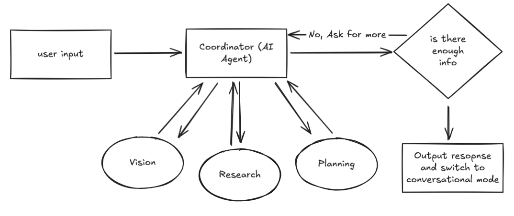
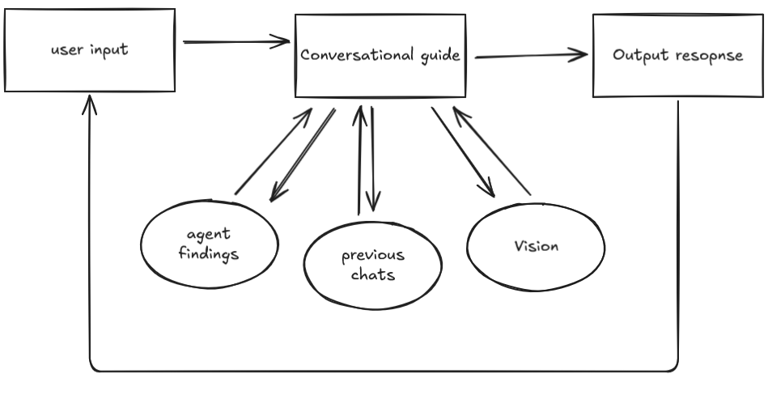

# FixitAI Backend
the backend for the FixitAI app

## How it works

1. The API creates a new session and starts in listening mode
2. the user sends an input to the API, the API will call the coordinator, which will have 3 agents running in parallel<br/>**Vision Agent**: uses gemma 3 to see what the type of product is as well as it's condition<br/>**Research agent**: analyzes all sources of fixing and upcycling, depending on the user's request, the sources are from IFixIt, WikiHow, and product manuals<br/>**Planning agent**: with all the resources the coordinator has, the Agent can plan how to help the user with fixing and upcycling a product
3. once the agent is confident enough with what it has, it will give an output that it's ready and it switches to conversational mode, otherwise, it will go back to the coordinator and get more info from it

Here's a graph of the conversational mode

1. The user sends an input to the API, the API will call the conversational guide, which will analyze the next step or assist the user by the agent findings, previous chats, and vision if a capture is given
2. the conversational guide will then send an output response, and then waits for another input from the user

## Setup
1. clone the repo
2. make an ngrok account using the link https://ngrok.com and follow the instructions for your recommended OS and activate the static link
3. install and activate the virtual environment
```
> py -m venv venv

# for Windows
> /venv/Scripts/activate

# for Linux and MacOS
> source <path_to_venv>/bin/activate 
```
4. Install the modules from `requirements.txt`
```
> pip install -r requirements.txt
```
5. Install `gemma3:latest` from ollama, if you haven't installed ollama yet, install it from this link: https://ollama.com/download
```
ollama pull gemma3:latest
```

## Run the backend
1. Enter the following command
```
> python api.py
```
2. to test this, go to `streamlittest.py`, switch the API_URL to your static Ngrok URL, and run the following command
```
> streamlit run streamlittest.py
```